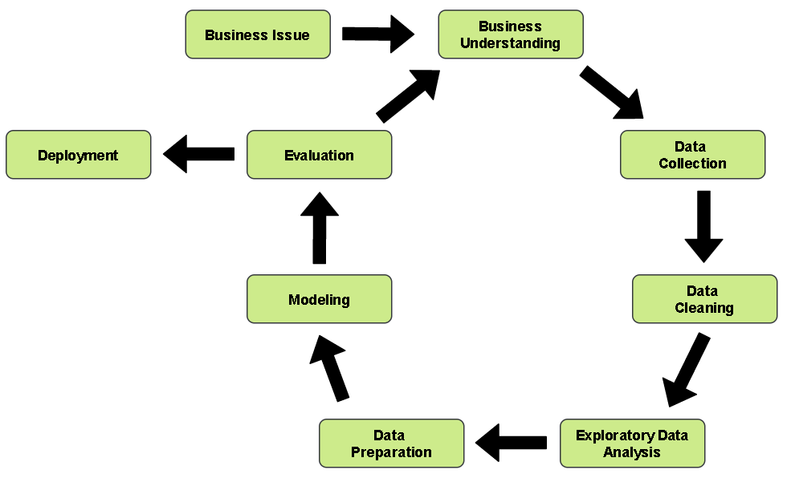
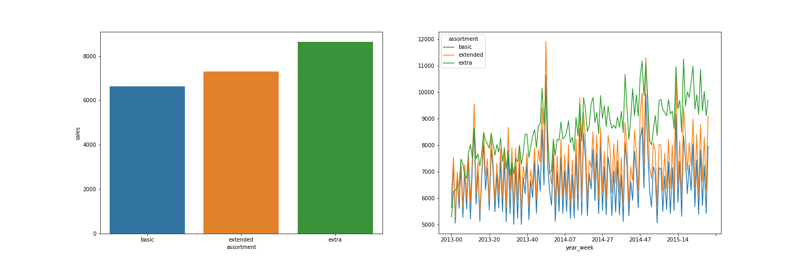
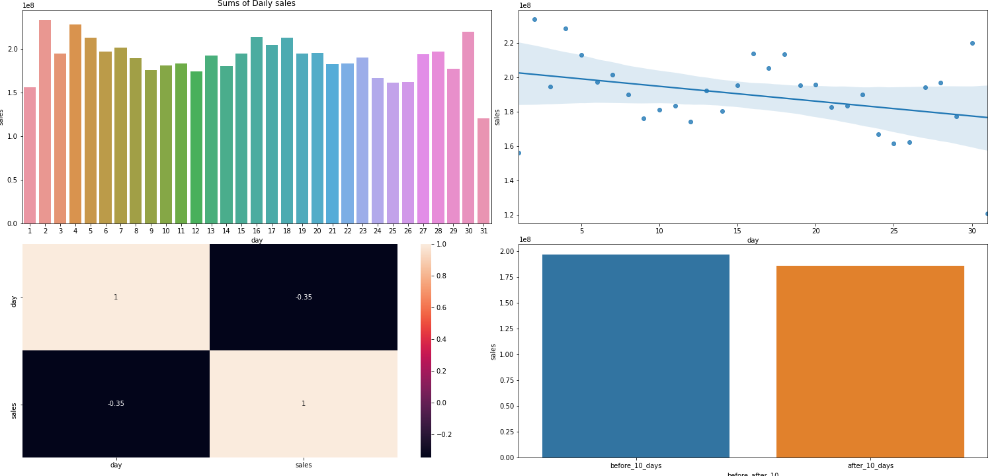
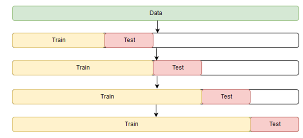

# Rossmann Stores Sales Forecast

## Predicting the income of the units of a chain store

## Business Problem

Rossmann is one of the largest drug store chains in Europe with around 56,200 employees and more than 4000 stores.[1](https://www.retail-index.com/sectors/personalcareretailersineurope.aspx) In 2019 Rossmann had more than €10 billion turnover in Germany, Poland, Hungary, the Czech Republic, Turkey, Albania, Kosovo and Spain. 

Store managers were tasked with predicting their daily sales for up to six weeks in advance. It is believed that sales are influenced by many factors, including promotions, competition, school and state holidays, seasonality, and locality. This task was assigned to the Data Science team of the whole chain, who must model the historical database in order to generate the desired forecasting. 

The [database](https://www.kaggle.com/c/rossmann-store-sales) spans around 2.5 years in time (between 2013 and 2015) and 1115 stores in total.

## Solution Strategy

The resolution of the challenge was carried out following the CRISP (CRoss-Industry Standard Process for data mining) methodology, which is a cyclical approach that streamlines the delivery of value.

In order to solve this challenge, the work went along the following steps:
1. **Data Description:** understanding of the status of the database and dealing with missing values properly. Basic statistics metrics furnish an overview of the data.  
2. **Feature Engineering:** derivation of new attributes based on the original variables aiming to better describe the phenomenon that will be modeled, and to supply interesting attributes for the Exploratory Data Analysis.
3. **Data Filtering:** filtering of records and selection of attributes that do not contain information for modeling or that do not match the scope of the business problem.
4. **Exploratory Data Analysis (EDA):** exploration of the data searching for insights and seeking to understand the impact of each variable on the upcoming machine learning modeling.
5. **Data Preparation:** preprocessing stage required prior to the machine learning modeling step.
6. **Feature Selection:** selection of the most significant attributes for training the model.
7. **Machine Learning Modeling:** implementation of a few algorithms appropriate to the task at hand. In this case, models befitting the *regression* assignment - *i.e.*, forecasting a continuous value, namely sales.
8. **Hyperparameter Fine Tuning:** search for the best values for each of the parameters of the best performing model(s) selected from the previous step.
9. **Translation and Interpretation of the Model Performance:** conversion of the performance metrics of the Machine Learning model to a more tangible business result.
10. **Deployment of Model to Production:** publication of the model in a cloud environment so that the interested people can access its results to improve business decisions.

## Top 3 Insights From Exploratory Data Analysis

Eleven hypotheses were validated in the exploratory data analysis. Of these, the 3 most relevant hypotheses were:

- **Hypothesis 1:** stores with greater assortment have a bigger income.  
- 
   ***True:*** among the 3 possible assortments for each unit, those in the 'extra' category sell more in average than those in 'extended', which, by its turn, sell more in average than those in 'basic'.

- **Hypothesis 2:** stores perform better in terms of sales after the 10th day of each month.  
- 
   ***False:*** the average performance is better for the first 10 days of the month.

- **Hypothesis 3:** stores should sell less during school holidays.
- 
   ***True:*** in average, Stores sell more on school holidays.

## Machine Learning Modeling Performance

As the data varies over time, and the objective is to forecast sales in the next 6 weeks, time series cross validation was applied as shown in the image below.

In time series cross-validation, a reduced portion of the training database is separated in each iteration, where a final period is set aside for validation. In order to forecast sales for the next 6 weeks, at each new iteration of cross validation, the last 6 weeks of the training set have been separated for validation. The cross-validation performance was the average of each of these iterations.

Four different models (linear regression, regularized linear regression - lasso, random forest and XGBoost Regressor) were evaluated using cross-validation. 

Were used 5 folds to perform the cross validation.The results in terms of Mean Absolute Error (MAE), Mean absolute percentage error (MAPE) and Root Mean Square Error (RMSE), were:

|Model|MAE|MAPE|RMSE|
|-----------------------------|------------------|-------------|------------------|
|Random forest regressor      |837.80 +/- 214.98 |0.12 +/- 0.02|1256.26 +/- 310.60|
|Linear regression            |2078.09 +/- 295.43|0.3 +/- 0.02 |2946.66 +/- 468.06|
|Lasso                        |2117.99 +/- 342.74|0.29 +/- 0.01|3058.17 +/- 506.07|
|XGBoost regressor            |7049.73 +/- 589.3 |0.95 +/- 0.0 |7718.99 +/- 689.76|

	
Despite having the worst results, the XGB Regressor was chosen to continue the project, as it is a model that has been showing excellent results in several data science competitions and is lighter than the Random Forest Regressor, and can be more easily published in production. 

## Hyperparameter Tuning

Using the random search precedure, with different values for the parameters "n_estimators", "eta", "max_depth", "subsample", "colsample_bytree" and "min_child_weight", 10 different iterations of XGBoost were performed, all evaluated using cross-validation. The values of MAE, MAPE and RMSE are detailed in the notebook for all the iterations.

The performance of the chosen model was:

|Model|MAE|MAPE|RMSE|
|-----------------------------|------------------|-------------|------------------|
|XGBoost regressor            |770.787           |0.116        |1110.18|

And then the model was trained with the entire training data. The performance on the test data was:

|Model|MAE|MAPE|RMSE|
|-----------------------------|------------------|-------------|------------------|
|XGBoost regressor            |826.29 +/- 99,62  |0.11 +/- 0.01|1200.79 +/- 172.27|

## Business Perfromance	

Finally, with the model trained, it's time to translate model performance into business performance. Considering the MAE obtained in the forecast for each store, during the test period, the best and worst sales scenarios for each store were projected.

Below is the performance of 5 randomly sampled stores, showing the total sales prediction for the next 6 weeks:

|store       | predictions| worst scneario| best scenario|MAE|MAPE|
|------------|-----------|----------|-----------|--------|------|
|573         |324,304,34 |320,451,50| 322,157,19| 852,84 | 0,08 |
|863         |163,751.41	|163,430.16	|164,072.65	|321.24	|0.07|
|811         |226,083.36	|225,222.91	|226,943.81	|860.45	|0.18|
|178         |277,968.44	|277,191.01	|278,745.87	|777.43	|0.11|
|289         |411,175.59	|410,125.14	|412,226.05	|1,050.46	|0.08|

Being **worst scenario** = prediction - MAE and **best scenario** = prediction + MAE

### Total Performance

By adding the sales forecasts for all stores for the next 6 weeks, the following results were obtained:

| Scenario| Values|
|---------|-------|
|predictions| 286,746,880.00|
|worst scenarion| 286,746,880.00|
|best scenario  | 287,609,874.99|

**Day-wise**, the predictions generated by the final model exhibited mean absolute errors

> *smaller than 15%* for *97.04%* of the stores, 

and 

> *smaller than 10%* for *67.53%* of them.

As for the initial request of the managers, in the total of the **last 6 weeks of records** in the database (test subset), the total error of the predictions was
> ***smaller than 10%*** for ***97.58%*** of the stores,

and

> ***smaller than 5%*** for ***75.7%*** of them.

In the overall of the stores, the ***actual income of $289,571,750.00*** for the 6 weeks was ***predicted to be $286,722,368.00***, what corresponds to a subestimation of ***0.98%***.

## Conclusions

The final model performed satisfactorily enough to be deployed to production. Notice that the deployment scripts are included in the last section of the notebook file, but were employed as in the standalone folders (see inside 'deployment'), which were pushed to a cloud storage (in this case, Heroku).

The predictions can be conveniently accessed through a Telegram bot just by messaging the number of desired store (that is, between 1 and 1115), one at a time, as in the following preview.

Notice that some of them are not available in the production dataset. Also, the bot might be idle most of the time, so be patient on your request (it should not take more than 1 minute to have a response).

### Accessing the bot

It is very straightforward, just look for @rossmann_sales_forecast_bot on Telegram or click the button below:

## *Note on visualization*

A better reading of the main notebook might be achieved by enabling the following [Jupyter Notebook Extensions](https://github.com/ipython-contrib/jupyter_contrib_nbextensions):
- Collapsible Headings;
- Hide input;
- Split Cells Notebook.
